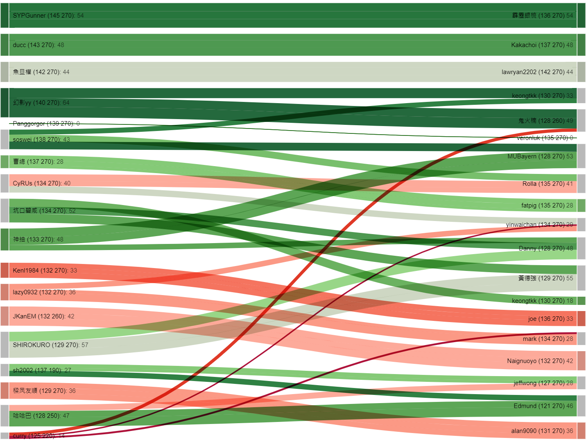
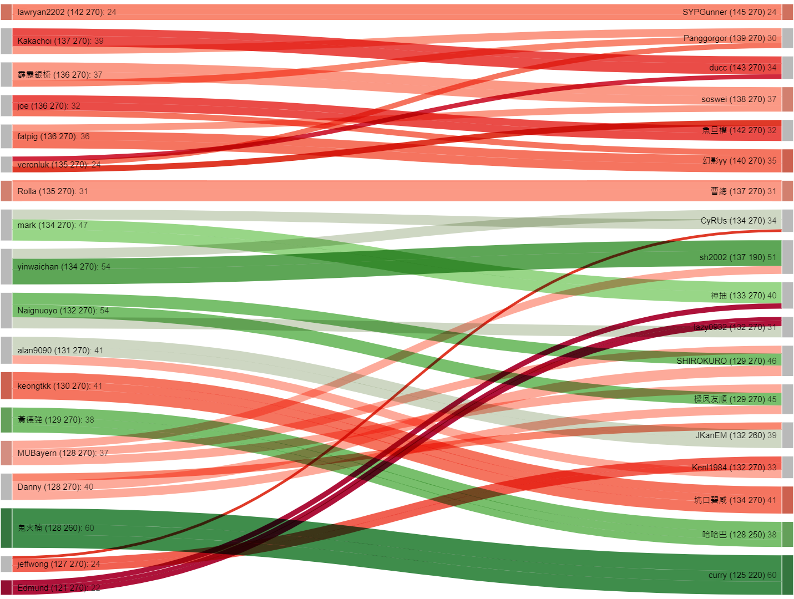

# FIFA Mobile League Tournament Analysis

Technology/library used: numpy, matplotlib, pandas, Tableau, D3, JavaScripts

## 1. Data Entry

This part will be the most time-consuming section of the whole data visualization pipeline.

Since there isn't any API(s) are available for the game, the only way to get the game data is to input manually.

The sample of the input data:

|playername|playerOVR|playerCHEM|goalScored|opponentName|opponentOVR|opponentCHEM|playerLeague|opponentLeague|
|---       |---      |---       |---       |---         |---        |---         |---         |---           |
|John689   |   101   |   270    |    12    |   Dan831   |    107    |     264    |      0     |      1       |
|John689   |   101   |   270    |    5     |   Tom777   |    123    |     265    |      0     |      1       |
|Tom777    |   123   |   265    |    18    |   John689  |    101    |     270    |      1     |      0       |

## 2. Data pre-process

The data pre-processing work are all done by the Jupyter Notebook.

Details and structures are included in the ipynb file.

## 3. Data Vis

Sankey Diagram: 

The diagram is generated by a JavaScript code using the library d3.

The diagram can be downloaded after we pasting the match feed where we generated by the python code.

Sankey Diagram produced in the following site:
https://observablehq.com/@mbostock/flow-o-matic

# Hong Kong Tournament Analysis

#### All players have participated in the competition.

#### Result: (Scots Boys) 681 - 713 (HongKongers)

#### Interactive Dashboard is also available using the famous BI Tool -- [Tableau](https://public.tableau.com/profile/mattfootballvis#!/vizhome/FMtournament/HK)

Few interesting insights are generated.

### 1. Average goal scoreded per match in the tournament: 12.907

### 2. Scots Boys has a tiny advantages comparing to HongKongers in terms of overall power.

Average power of Scots Boys: 160.083

Average power of HongKongers: 160.056

### 3. Power among Scots Boys are more diverse than HongKongers.

Standard deviation of power for Scots Boys: 6.317

Standard deviation of power for HongKongers: 4.811

### 4. Goal scored among Scots Boys are more diverse than HongKongers.

Standard deviation of the goal scored for Scots Boys: 5.503

Standard deviation of the goal scored for HongKongers: 4.384

### 5. HongKongers struggle more since more than half of their matches are playing against a higher power opponent.
### In contrast, Scots Boys only got 7 players (out of 18) playing against an opponent who has a higher power.

## Data Encoding:

#### Color: Power Difference

#### Area/Length: Goal Scored

Sankey Diagram for Scots Boys:

Sankey Diagram for HongKongers:

